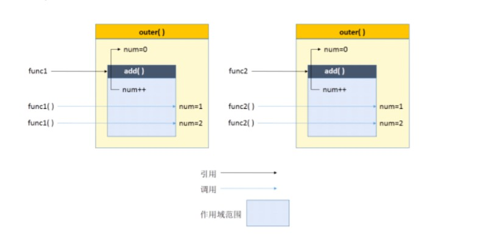

# 基础面试题's brother

## HTML :pushpin:

### 1.行内元素有哪些？块级元素有哪些？空(void)元素有哪些？

* 首先：CSS规范规定，每个元素都有display属性，确定该元素的类型，每个元素都有默认的display值，如div的display默认值为“block”， 则为“块级”元素；span默认display属性值为“inline”，是“行内”元素。

1. 行内元素：`a b i em del sup sub tt span img input select strong `

   ​					h5新增`bdo abbr q cite code dfn ins`

2. 块级元素：`div ul ol li dl dt dd h1~h6 p address center pre xmp blockquote   `

3. 常见的空元素：`<br> <hr>  <input> <link> <meta>`

   鲜为人知的是：`<area> <base> <col> <command> <embed> <keygen> <param> <source> <track> <wbr>`


## CSS :round_pushpin:

### 1.解决IE图片失真

```css
img { -ms-interpolation-mode: bicubic; }
```

### 2.CSS Hack分类

* `CSS Hack`大致有3种表现形式，CSS属性前缀法、选择器前缀法以及IE条件注释法（即HTML头部引用if IE）Hack，实际项目中`CSS Hack`大部 分是针对IE浏览器不同版本之间的表现差异而引入的。

1. <b>属性前缀法</b>(即类内部Hack)：例如 `IE6能识别下划线"_"和星号" * "，IE7能识别星号" * "，但不能识别下划线"_"，IE6~IE10都认 识"\9"，但firefox前述三个都不能认识`
2. <b>选择器前缀法</b>(即选择器Hack)：例如 `IE6能识别html .class{}，IE7能识别*+html .class{}或者*:first-child+html .class{}`
3. <b>IE条件注释法</b>(即HTML条件注释Hack)：`针对所有IE(注:IE10+已经不再支持条件注释)：IE浏览器显示的内容 ，针对IE6及以下版本。这类Hack不仅对CSS生效，对写在判断语句里面的所有代码都会生效。`


### 3.CSS3新增特性

1. 新增选择器:`nth-child(even)`、`nth-child(odd)`、`:not(.textinput)`、`E:empty`、`E:checked `、`E:enabled` 、`E:disabled`、`E::selection`、`E:not(s)`等； 
2. @Font-face使用服务器字体； 
3. Word-wrap（字母断行不分开） & Text-overflow（clip、ellipsis裁剪） 样式、文字渲染Text-decoration； 
4. CSS3 的多列布局（multi-column layout）； 
5. 边框和颜色（支持透明度和圆角） rgba(255, 0, 0, 0.75)、border-radius: 15px； 
6. CSS3 的水平、径向渐变效果（Gradient）； 
7. 阴影（Shadow）和反射（Reflect）效果； 
8. 多背景效果； 
9. Transitions, Transforms 和 Animation；

### 4.经常遇到的浏览器的兼容性有哪些？原因？解决方法是什么，常用hack的技巧？

* png24位的图片在iE6浏览器上出现背景

  解决方案：做成PNG8

* 浏览器默认的margin和padding不同

  解决方案：加一个全局的`*{margin:0;padding:0;}`来统一。 

* IE6双边距bug:块属性标签float后，又有横行的margin情况下，在ie6显示margin比设置的大。浮动ie产生的双倍距离 `#box{ float:left; width:10px; margin:0 0 0 100px;} `这种情况之下IE会产生20px的距离

  解决方案：在float的标签样式控制中加入 ——`_display:inline;`将其转化为行内属性。(_这个符号只有ie6会识别) 渐进识别的方式，从总体中逐渐排除局部。 首先，巧妙的使用“\9”这一标记，将IE游览器从所有情况中分离出来。 接着，再次使用“+”将IE8和IE7、IE6分离开来，这样IE8已经独立识别。

  ```css
  例如：
   	.bb{
   		background-color:#f1ee18;/*所有识别*/
   		.background-color:#00deff\9; /*IE6、7、8识别*/
   		+background-color:#a200ff;/*IE6、7识别*/
   		_background-color:#1e0bd1;/*IE6识别*/
   	}
  ```

* IE下,可以使用获取常规属性的方法来获取自定义属性, 也可以使用`getAttribute()`获取自定义属性; Firefox下,只能使用`getAttribute()`获取自定义属性。 

  解决方法：统一通过`getAttribute()`获取自定义属性。

* IE下,even对象有x,y属性,但是没有`pageX`,`pageY`属性; Firefox下,event对象有`pageX`,`pageY`属性,但是没有x,y属性。 

  解决方法：（条件注释）缺点是在IE浏览器下可能会增加额外的HTTP请求数。 Chrome 中文界面下默认会将小于 12px 的文本强制按照 12px 显示, 可通过加入 CSS 属性 `-webkit-text-size-adjust: none;` 解决。

* 超链接访问过后hover样式就不出现了 被点击访问过的超链接样式不在具有hover和active了

  解决方法：改变CSS属性的排列顺序: `L-V-H-A : a:link {} a:visited {} a:hover {} a:active {} `

### 5.CSS里的visibility属性有个collapse属性值是干嘛用的？在不同浏览器下以后什么区别？

* 当一个元素的visibility属性被设置成collapse值后，对于一般的元素，它的表现跟hidden是一样的。但例外的是，如果这个元素是table 相关的元素，例如table行，table group，table列，table column group，它的表现却跟display: none一样，也就是说，它们占用的空间 也会释放。 在谷歌浏览器里，使用collapse值和使用hidden值没有什么区别。 在火狐浏览器、Opera和IE11里，使用collapse值的效果就如它的字面意思：table的行会消失，它的下面一行会补充它的位置。

### 6.CSS优化、提高性能的方法有哪些？

1. 使用简写

   简写可以使CSS文件更小

   ```css
   例如：
   p{
   	margin-top:1px;
   	margin-right:2px;
   	margin-bottom:3px;
   	margin-left:4px;
   }
   //使用下面的缩写代替上面的
   p{
   	margin:1px 2px 3px 4px;
   }
   ```

2. 消除不需要的零和单位

   CSS支持多种单元和数字格式。这些单元和格式正好是值得优化的目标——可以删除小数点前后无实际意义的零，如下面的代码片段所示。此外，请记住，零始终是零，添加维度不会为包含的信息添加值。

   ```css
   padding:0.2em;
   margin:20.0em;
   avalue:0px;
   padding:.2em;
   margin:20em;
   avalue:0;
   ```

3. 消除过度分号

   这种优化从某种程度来说也是非常关键的，因为它会影响代码的更改。CSS规范允许省略属性组中的最后一个分号。由于这种优化方法节省的资源很少，因此我们主要针对那些使用自动优化器的人来介绍这种方法。

   ```css
   p{
   ...
      font-size:1.33em 
   }
   ```

4. 使用雪碧图

5. 删除px

   一个提高性能的好方法是使用CSS标准的一个特性。没有单位的数值被假定为像素——删除px可以为每个数字节省两个字节。

6. 删除空格

   空格（想想代码或文本中的制表符、回车和空格）——使代码更容易阅读，但从解析器的角度看，它几乎没有什么用处。

### 7.浏览器是怎样解析CSS选择器的？

浏览器对选择器的解析规则是从右到左解析的，比如`.box .left p`,会在页面中找到所有的`p标签`，然后在`p标签`中找其父元素有`.left类`的`p元素`，再找祖父元素有`.box`的`p标签`。

### 8.在网页中应该使用奇数还是偶数的字体？为什么呢？

* 偶数字号相对更容易和 web 设计的其他部分构成比例关系。比如：当我用了 14 px 的正文字号，我可能会在一些地方用 14 × 0.5 = 7 px 的 margin，在另一些地方用 14 × 1.5 = 21 px 的标题字号。

### 9.margin和padding分别适合什么场景使用？

```css
margin:
     需要在border外侧添加空白时；
     空白处不需要背景（色）时；
     上下相连的两个盒子之间的空白，需要相互抵消时。
padding：
    需要在border内测添加空白时；
    空白处需要背景（色）时；
    上下相连的两个盒子之间的空白，希望等于两者之和时。
```

### 10.抽离样式模块怎么写，说出思路，有无实践经验？[阿里航旅的面试题]

> 小编在寻找答案的路上

### 11.元素竖向的百分比设定是相对于容器的高度吗？

我们大家都知道，当按百分比设定一个元素的宽度时，它是相对于父容器的宽度计算的，但是，对于一些表示竖向距离的属性，例如 `padding-top` , `padding-bottom` , `margin-top` , `margin-bottom` 等，当按百分比设定它们时，依据的也是父容器的宽度，而不是高度。

> 下面是示例，不信？试试？实践出真知。

```html
<!--html-->
	  <div class="wrapper lazy " id="w">
        <div class="box lazy " id="b"></div>
      </div>
      
      <input type="range" min="120" max="400" value="400" class="range lazy " id="r">
      <output>宽度是: <span id="op">400px</span></output>
      <output>黄块块的Padding bottom是:<br><span id="op2">10%</span></output>
```

```css
/*css*/
body {
  font-family: Arial, sans-serif;
  padding-top: 30px;
  text-align: center;
}

.wrapper {
  width: 400px;
  margin: 0 auto;
  border: solid 1px black;
}

.box {
  width: 100px;
  height: 100px;
  background: gold;
  margin-left: auto;
  margin-right: auto;
  padding-top: 10%;
  padding-bottom: 10%;
  margin-bottom: 5%;
}

.range {
  display: block;
  margin: 20px auto;
}

output {
  text-align: center;
  display: block;
  font-weight: bold;
  padding-bottom: 20px;
}

output span {
  font-weight: normal;
}
```

```js
//js
var cw = document.getElementById('w'),
    r = document.getElementById('r'),
    b = document.getElementById('b'),
    op = document.getElementById('op'),
    op2 = document.getElementById('op2');

r.onchange = function () {
  cw.style.width = this.value + 'px';
  op.innerHTML = this.value + 'px';
  op2.innerHTML = window.getComputedStyle(b, null).getPropertyValue('padding-top');
};
```

> 对于竖直方向的margin和padding，参照父元素的宽度。
>
> 对于水平方向的margin和padding，也是参照父元素的宽度。

### 12.全屏滚动的原理是什么？用到了CSS的那些属性？

全屏滚动的原理就是每次滚动滚轮，屏幕移动的距离就刚好是一个屏幕的距离，利用css的高度百分比实现这个效果，因为设定百分比的值是需要更具父元素设置的所以需要给html，body都设置为高度百分百，然后一层一层的设置，用js控制鼠标滚轮事件。

### 13.什么是响应式设计？响应式设计的基本原理是什么？如何兼容低版本的IE？

* 响应式设计就是为了实现根据不同设备环境自动响应及调整网页布局的一种设计方案。
* 基本原理就是利用css的媒体查询功能更具不同屏幕的大小，向下兼容设备、移动优先，达到响应的效果。
* 兼容IE可以使用JS辅助一下来解决

### 14.视差滚动效果，如何给每页做不同的动画？（回到顶部，向下滑动要再次出现，和只出现一次分别怎么做？）

> 小编在寻找答案的路上

### 15.  ::before 和 :after中双冒号和单冒号有什么区别？解释一下这2个伪元素的作用。

* 双冒号是在当前规范中引入的，用于区分伪类和伪元素。但是伪类兼容现存样式，浏览器需要同时支持旧的伪类，比如:first-line、:first-letter、:before、:after等。
* 对于CSS2之前已有的伪元素，比如:before和:after，单冒号和双冒号的写法::before和::after作用是一样的。
* 如果只需要兼容webkit、firefox、opera等浏览器，建议对于伪元素采用双冒号的写法，如果不得不兼容IE浏览器，还是用CSS2的单冒号写法比较安全。

### 16.如何修改chrome记住密码后自动填充表单的黄色背景 ？

chrome 表单自动填充后，input文本框的背景会变成黄色的，通过审查元素可以看到这是由于chrome会默认给自动填充的input表单加上input:-webkit-autofill私有属性，然后对其赋予以下样式：

```css
input : -webkit-autofill {
    background-color : #FAFFBD;
    background-image : none;
    color : #000;
}
```

在有些情况下，这个黄色的背景会影响到我们界面的效果，尤其是在我们给input文本框使用图片背景的时候，原来的圆角和边框都被覆盖了：

* 情景一：input文本框是纯色背景的可以对input:-webkit-autofill使用足够大的纯色内阴影来覆盖input输入框的黄色背景；如：

```css
input : -webkit-autofill {
    -webkit-box-shadow : 0 0 0px 1000px white inset; 
    border : 1px solid #CCC !important;
}
```

如果你有使用圆角等属性，或者发现输入框的长度高度不太对，可以对其进行调整，除了chrome默认定义的background-color，background-image，color不能用!important提升其优先级以外，其他的属性均可使用!important提升其优先级，如：

```css
input : -webkit-autofill {
    -webkit-box-shadow : 0 0 0px 1000px white inset ;
    border : 1px solid #CCC !important ;
    height : 27px !important ;
    line-height : 27px !important ;
    border-radius : 0 4px 4px 0 ;
}
```

* 情景二：input文本框是使用图片背景的

  这个比较麻烦，目前还没找到完美的解决方法，有两种选择：

  1. 如果你的图片背景不太复杂，只有一些简单的内阴影，那个人觉得完全可以使用上面介绍的方法用足够大的纯色内阴影去覆盖掉黄色背景，此时只不过是没有了原来的内阴影效果罢了。

  2. 如果你实在想留住原来的内阴影效果，那就只能牺牲chrome自动填充表单的功能，使用 js 去实现，例如：

     ```js
     $(function(){
         if( navigator.userAgent.toLowerCase().indexOf("chrome")>=0){
             $( window ). load ( function (){
             $('ul input:not(input[type=submit])' ).each(function(){
             var outHtml = this.outerHTML ;
             $(this).append( outHtml );
             });
         });
         }
     });
     ```

遍历的对象可能要根据你的需求去调整。如果你不想使用js，好吧，在form标签上直接关闭了表单的自动填充功能：`autocomplete="off"`。

### 17.你对line-height是如何理解的？

* line－height是用来设置字体的行高，可以理解为设置文字高度的占位大小，单位可以是数字，或者像素
* 数字：更具文字的大小来决定  1.5相当于文字大小的1.5倍
* 像素：就是通常的px大小了

> <a href="https://www.zhangxinxu.com/wordpress/2009/11/css行高line-height的一些深入理解及应用/">觉得解释有些牵强？想更深入理解？点我试试？</a>:100::eyeglasses:

### 18.设置元素浮动后，该元素的display值是多少？

自动变成`display:block`

### 19.怎么让Chrome支持小于12px 的文字？

```css
-webkit-text-size-adjust:none;
```

### 20.让页面里的字体变清晰，变细用CSS怎么做？

```css
-webkit-font-smoothing: antialiased;
```

## JS :rainbow_flag:

### 1.请至少写出2种方法，不通过第三个中间变量，交换2变量的值

```js
1.
a=3 b=5
(function(){
    var a=10,b=2;
    	a=a+b;
    	b=a-b;
    	a=a-b;
    alert(a+" "+b);
})();
2.
(function(){
    var a=10,b=2;
    	a=a^b;
    	b=b^a;
    	a=a^b;
    alert(a+" "+b);
})();
```

### 2.什么是闭包，请写出一个简单的例子说明。

**闭包就是函数中的函数，里面的函数可以访问外面函数的变量；外面的变量是这个内部函数的一部分。**

```js
function outer{
    var num=0;
    return function add(){
        num++;
        console.log(num);
    };
}
var func1=outer();
	func1();//实际上是调用add函数，输出1
	func1();//输出1
var func2=outer();
	func2();//输出1
	func2();//输出2
```


### 3.闭包的作用

1. 使用闭包可以访问函数中的变量
2. 可以使变量长期保存在内存中，声明周期比较长

* 加分项

  闭包不能滥用，否则会导致内存泄漏，影响网页的性能。闭包使用完后，要立即释放资源，将引用变量指向null

  答：是指有权访问另一个函数作用域中的变量的函数。创建闭包常见的方式，就是在一个函数内部创建另一个内部(私有)函数。

  ```js
  例如：
  function test(){
      var x=10;
      return function(){
          return x;
      }
  }
  alert(x);//调用局部变量x，报错未定义
  var a=test();//调用
  alert(a());
  ```


### 4.说几条写JS的基本规范

1. 不要在同一行声明多个变量。 
2. 请使用 ===/!==来比较true/false或者数值 
3. 使用对象字面量替代new Array这种形式 
4. 不要使用全局函数。 
5. Switch语句必须带有default分支 
6. 函数不应该有时候有返回值，有时候没有返回值。 
7. For循环必须使用大括号 
8. If语句必须使用大括号 
9. for-in循环中的变量 应该使用var关键字明确限定作用域，从而避免作用域污染。

### 5.JavaScript有几种类型的值？你能画一下他们的内存图吗？

* 栈：原始数据类型（Undefined，Null，Boolean，Number、String） 
* 堆：引用数据类型（对象、数组和函数）

* 两种类型的区别是：存储位置不同； 原始数据类型直接存储在栈(stack)中的简单数据段，占据空间小、大小固定，属于被频繁使用数据，所以放入栈中存储； 引用数据类型存储在堆(heap)中的对象,占据空间大、大小不固定,如果存储在栈中，将会影响程序运行的性能；引用数据类型在栈中存储了 指针，该指针指向堆中该实体的起始地址。当解释器寻找引用值时，会首先检索其 在栈中的地址，取得地址后从堆中获得实体

### 6.Javascript如何实现继承？

1. 属性继承
2. call、apply、bind()
3. 原型链继承
4. 构造函数继承
5. 组合继承
6. 计生组合继承

```js
1.属性继承
function Parent(){
    this.name="wang";
}
function Child(){
    this.age=21;
}
Child.prototype=new Parent()//继承了Parent,通过原型
var demo=new Child()//实例化
alert(demo.age);
alert(demo.name);//得到被继承的属性
```

```js
2.call//继承谁.call(谁继承,"参数","参数");
function Animal(){
    this.name="Animal";
    this.sayName=function(){
        alert(this.name);
    }
}
function Cat(){
    this.color="yellow";
}
var animal=new Animal();
var cat=new Cat();
Animal.call(cat,"");//使用字符串来写  继承的是Animal的属性和方法给cat
cat.sayName();//继承过来后cat使用一次sayName这个方法
```

```js
apply://继承谁.call(谁继承,["参数","参数"]);
Animal.apply(cat,["red","Lily"]);
```

```js
bind()//继承谁.bind(谁继承,"")();
Animal.bind(cat,"")();
```

```js
3.原型链继承
function Person(name){
    this.name=name;
};
Person.prototype.getName=function(){
    return this.name;
};
function test(){}
    test.prototype.sex="man";
    test.prototype.getSex=function(){
        alert(this.sex);
    }
test.prototype=new Person("");//可以获取到Person与Person.prototype上的值
var a=new test();
a.getSex();
a.getName();
```

```js
4.构造函数继承
function Person (name) {	//父类
    this.name = name;
    this.friends = ['小李','小红'];
    this.getName = function () {
        return this.name;
    }
};
function Parent (age) {		//子类
    Person.call(this,'老明');	//这一句是核心关键
    //这样就会在新parent对象上执行person构造函数中定义的所有对象初始化代码，
    //结果parent的每个实例都会聚有自己的friends属性的副本
    this.age = age;
};
var result = new Parent(23);
console.log(result.name);	//老明
console.log(result.friends);	//['小李','小红']
console.log(result.getName());	//老明
console.log(result.age);	//23
console.log(result.getSex());	//这个会报错，调用不了父类原型上面扩展的方法
```

```js
5.组合继承
function Person(name){
    this.name=name;
    this.friends=["小李","小红"];
};
Person.prototype.getName=function(){
    return this.name;
};
function Parent(age){
    Person.call(this,"老明");
    this.age=age;
};
Parent.prototype=new Person("老明");
var result=new Parent(24);
console.log(result.name);
console.log(result.getName());
result.friends.push("小智");
console.log(result.friends);
console.log(result.age);
var result1=new Parent(25);
//通过借用函数都有自己的属性，通过原型享用公共得犯法 console.log(result.name);
console.log(result1.friends);//["小李","小红"]
```

```js
6.寄生组合继承
function Person(name){ //父类
    this.name=name;
    this.friends=["小李","小红"];
}
Person.prototype.getName=function(){  //父类原型对象
    return this.name;
};
function Parent(age){  //子类
    Person.call(this,"老明");
    this.age=age;
}
(function (){
    var Super=function(){};//创建一个没有实例化的类中  中间类
    Super.prototype=Person.prototype;  //直接把父类原型对象上面的属性和方法给中间类的原型对象了
    Parent.prototype=new Super();  //将中间类实例作为子类的原型
})();//相当于把父类给了Super然后再实例化Super[其实实例化super就是在实例化Person]最后把他赋给子类就完成了继承
var result=new Parent(23);
console.log(result.name);
console.log(result.friends);
console.log(result.getName());
console.log(result.age);
```

### 7.javascript创建对象的几种方式？

1. new 操作符 + Object 创建对象
2. 原始模式
3. 工厂模式
4. 构造函数
5. 混合模式
6. json

```js
1.new 操作符 + Object 创建对象
var person = new Object();
    person.name = "lisi";
    person.age = 21;
    person.family = ["lida","lier","wangwu"];
    person.say = function(){
        alert(this.name);
}
```

```js
2.原始模式
var person = new Object();
person.name="lily";
person.age=22;
person.talk=function(){
    alert("好好学习");
}
console.log("person.name");
person.talk();
```

```js
3.工厂模式
function test(){
    var person=new Object();
    person.name="Lily";
    person.age=19;
    person.talk=function(){
        alert("好好学习");
    }
    return person;
}
var a=test();
console.log(a.name);
a.talk();
```

```js
4.构造函数
function Person(){
    this.name="lily";//不写实例化的时候这个this代表的是window
    this.age=23;
    this.talk=function(){
        alert("好好学习");
    }
}
var persona =new Person();
console.log(persona.name);
```

```js
5.混合模式
function Person(){
    Person.prototype.name="lily";
    Person.prototype.age=23;
    Person.prototype.talk=function(){
        alert("你好");
    }
}
var persona=new Person();
console.log(persona.name);
```

```js
6.json
var person={
    "name":"lily",
    "age":30,
    "talk":function(){
        alert("好好学习");
    },
    children:[{
        "name":"TOM",
        "age":2
    },{
        "name":"jerry",
        "age":5
    }]
}
console.log(person.children[1].name);
```


